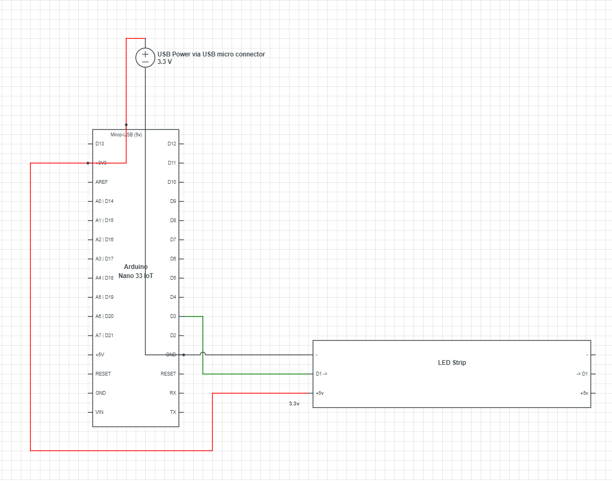
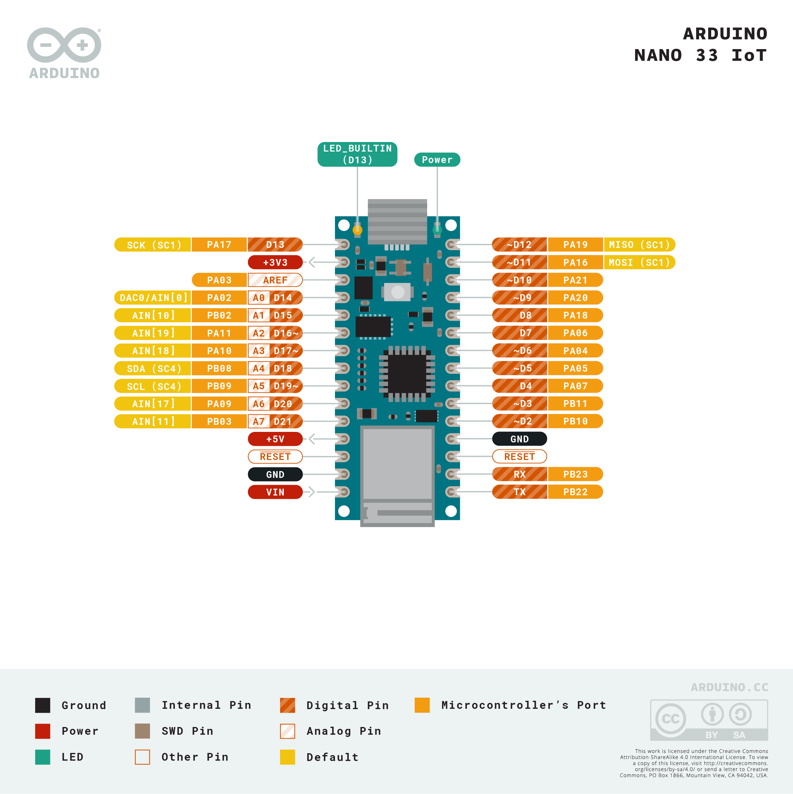

# Intro

An arduino sketch to run an LED strip behind my monitor. Ambition is to have an API to call, and an ambient light sensor to set brightness & on/off.

# Dev Environment

I wanted to write up a little bit about my dev setup. I don't often find this included in projects, so thought it was a good practice to get into including it here.

Your dev environment can totally be different, but here's what i'm doing...

regardless of whether you use Arduino IDE or vscode, you still need the IDE installed. I choose to use vscode as the editor because i'm familiar with it, it's quick and i can use extensions and sync with git etc.

**Versions below aren't a requirement, it's just what i'm using for your reference**

installed Arduino IDE (v1.8.13) https://www.arduino.cc/en/Main/Software
- Board Manager: Arduino SAMD Boards (v1.8.6)

  [Go into Tools -> Board -> Board Manager, and add **Arduino SAMD Boards** this takes AGES to install!!!]

installed vscode (v1.47.2) https://code.visualstudio.com/

 - Add Microsoft extension for Arduino (vsciot-vscode.vscode-arduino)
 - Install git (allows you to use GitHub etc for source) - https://git-scm.com/download/

 Set up source control - Azure Repos/GitHub (I'm using GitHub)

# Schematic

## Power
LED strip i'm using is WS2812B compatible - https://amzn.to/3303nyW
and uses 5050SMD LEDs - 5V DC, 350-450mcd/led - http://led-obzor.com/led/technical-specifications-smd-5050
Per LED:
 - Power: 0.21 W
 - Supply voltage: 3.3 volts
 - Rated current: 60mA (3x 20mA - per R/G/B)

 The strip we're working with is 36 pcs long, so:

 60mA * 36 pcs = 2160 mA = 2.16 A @ 3.3VDC - which is probably 3x LEDs too much for a 2A USB feed...
 60mA * 33 pcs = MAX 1980 mA = 1.98 A @ 3.3VDC (i.e. if all LEDS were at 255)

Should be able to run power from arduino 3.3VDC feed at that ampage (for 33 pcs), **but any more would need its own feed to run at MAX**.

## Arduino Pinout
